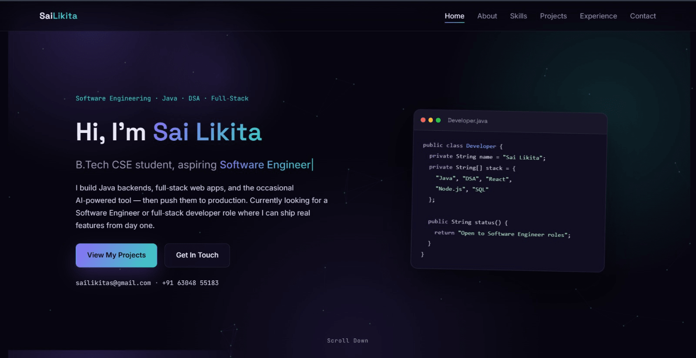
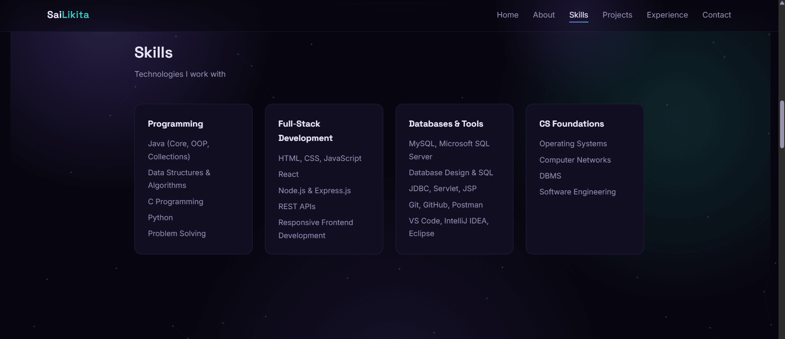

# 🌐 Sai Likita — Developer Portfolio

My personal developer portfolio showcasing my technical skills, projects, internships, certifications, and software development experience.

## 🚀 Live Website

[**https://sailikita123.github.io/portfolio-sailikita/**](https://sailikita123.github.io/portfolio-sailikita/)

## 👩‍💻 About

I am a Computer Science Engineering student focused on **Software Development, Full-Stack Web Development, Java, and Data Structures & Algorithms**.

This portfolio brings together my development projects, technical skills, internship experience, and certifications in one place.

## ✨ Features

* 👩‍💻 About Me section
* 🛠️ Technical skills
* 🚀 Project showcase
* 💼 Internship experience
* 📜 Certifications
* 📫 Contact information
* 📱 Responsive design

## 📸 Portfolio Preview

### Home


### Projects


### Skills


## 🛠️ Technologies

* HTML5
* CSS3
* JavaScript
* JSON
* Responsive Web Design

## 📂 Project Structure

```text
portfolio-sailikita/
│
├── index.html
├── styles.css
├── script.js
└── README.md
```

## 🎯 Highlights

The portfolio showcases my work and experience across:

* Full-Stack Web Development
* Frontend Development
* Java & Data Structures and Algorithms
* AI-powered applications
* Database-based applications
* Software Engineering projects

## 💻 Run Locally

### 1. Clone the repository

```bash
git clone https://github.com/sailikita123/portfolio-sailikita.git
```

### 2. Open the project

```bash
cd portfolio-sailikita
```

Open `index.html` in your browser.

## 🌐 Deployment

The portfolio is deployed using **GitHub Pages**.

### Live URL

[**https://sailikita123.github.io/portfolio-sailikita/**](https://sailikita123.github.io/portfolio-sailikita/)

## 🔮 Future Improvements

* Add detailed project case studies
* Improve accessibility
* Optimize website performance
* Add dark/light mode
* Add more project demonstrations
* Improve animations and interactions
* Add a backend-powered contact form

## 📬 Connect With Me

* 💻 GitHub: [**https://github.com/sailikita123**](https://github.com/sailikita123)
* 💼 LinkedIn: [**https://linkedin.com/in/sailikita05**](https://linkedin.com/in/sailikita05)
* 🌐 Portfolio: [**https://sailikita123.github.io/portfolio-sailikita/**](https://sailikita123.github.io/portfolio-sailikita/)

---

⭐ If you find this project useful, feel free to star the repository.
